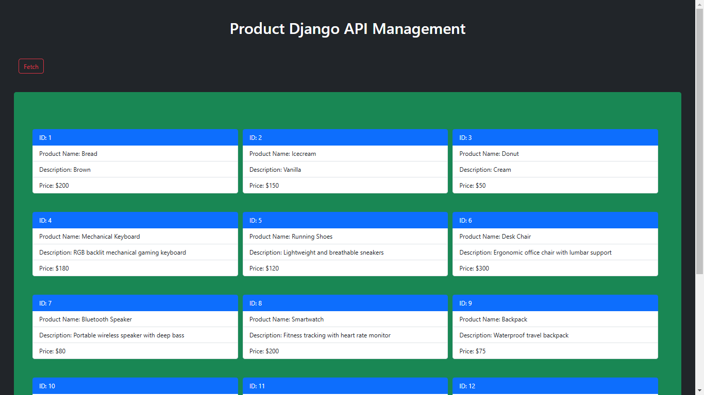

# Product DJango API

This is an API project for product management.
---


## **Product Management Front-End**

This front-end application is built with HTML, CSS, and JavaScript and interacts with a REST API to manage products. The key functionalities include:

### **Features**

1. **Product Form**:
   - Allows users to input product details:
     - Name
     - Description
     - Price
   - Submits the data to the API endpoint to create a new product.

2. **Product List**:
   - Dynamically fetches and displays all products from the API.
   - Refreshes automatically after adding a new product.

3. **Responsive and User-Friendly Design**:
   - Clean and minimal interface.
   - Responsive layout suitable for various screen sizes.

---

## **Setup Instructions**

### **1. Prerequisites**

Ensure the following are set up before running the front-end:

- A running back-end API for product management. This example assumes:
  - Base URL: `http://127.0.0.1:8000`
  - Endpoints:
    - `GET /store/product/` - Fetch all products.
    - `POST /store/product/create/` - Add a new product.

### **2. File Structure**

Save the provided code as `index.html`.

---

## **How to Use**

### **Step 1: Run Your Back-End API**

Ensure your back-end API is running on `http://127.0.0.1:8000`. If it's hosted on a different port or domain, update the API URLs in the `<script>` section of `index.html`.

### **Step 2: Open the Front-End**

1. Save the `index.html` file on your system.
2. Open the file in any modern web browser (e.g., Chrome, Firefox).

### **Step 3: Adding a Product**

1. Fill in the "Product Name," "Product Description," and "Price" fields in the form.
2. Click the **Add Product** button to submit the data.
3. If successful, the product list will refresh to include the new product.

---

## **API Integration**

This front-end relies on the following API endpoints:

1. **GET /store/product/**:
   - Used to fetch all products.
   - Returns an array of product objects in the following format:
     ```json
     [
       {
         "Pname": "Laptop",
         "Pdescription": "High-end gaming laptop",
         "price": 1500.0
       }
     ]
     ```

2. **POST /store/product/create/**:
   - Used to add a new product.
   - Accepts a JSON object:
     ```json
     {
       "Pname": "Laptop",
       "Pdescription": "High-end gaming laptop",
       "price": 1500.0
     }
     ```

---

## **Customization**

### **Change API Base URL**

To use a different API base URL, locate the following lines in the `<script>` section of `index.html`:

```javascript
const response = await fetch('http://127.0.0.1:8000/store/product/');
const response = await fetch('http://127.0.0.1:8000/store/product/create/', {
```

Replace `http://127.0.0.1:8000` with your API base URL.

---

## **Troubleshooting**

### **1. CORS Errors**

If the back-end API and front-end are hosted on different domains or ports, you may encounter CORS (Cross-Origin Resource Sharing) issues. Ensure the back-end API is configured to allow requests from the front-end's domain.

### **2. Debugging API Issues**

Use the browser’s developer tools (Network tab) to inspect API calls and responses.

### **3. Missing Products**

If products are not displayed, ensure:
- The API is returning data in the expected format.
- The back-end server is running correctly.

---

## **Contributing**

If you'd like to contribute, feel free to fork this repository and submit pull requests.

---

## **License**

This project is open-source and available under the MIT License.
